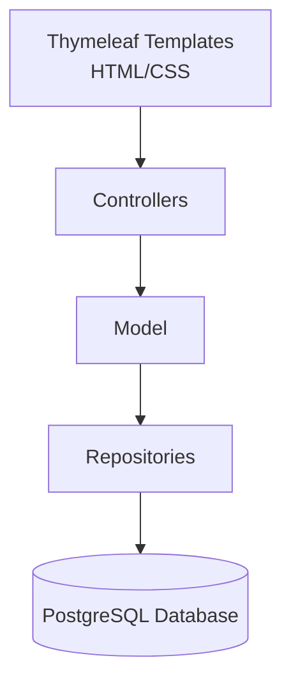

# ReBank

## 💻 About

ReBank is a web-based banking account management system.

The project is designed to allow customers to create an account, log in securely, manage their bank accounts, check balances, and perform transactions.

## ✨ Features

### Implemented

- **User registration** — create an account with a username, email, and password
- **User login** — log in using a username or email
- **Password validation** — checks required fields, password length, and password confirmation
- **Unique accounts** — usernames and email addresses must be unique
- **Password hashing** — passwords are hashed using BCrypt
- **Session management** — logged-in users are stored in an HTTP session
- **Logout** — safely ends the current user session
- **User dashboard** — displays the logged-in user's information
- **Database connection check** — verifies the connection to PostgreSQL when the application starts

### Project Scope

The project is designed to support the following banking features:

- Bank account management
- Balance checking
- Deposits and withdrawals
- Transfers between accounts
- Transaction history
- Customer and bank employee roles

The banking account, transaction, and role-management modules are not included in the current implementation.

## 🗂️ Core Tech Stack

| Layer | Technology |
|---|---|
| Backend | Java 21, Spring Boot 4.1.1 |
| Web framework | Spring MVC |
| Database access | Spring Data JPA, Hibernate |
| Database | PostgreSQL |
| Frontend | HTML, CSS, Thymeleaf |
| Password security | Spring Security Crypto, BCrypt |
| Build tool | Maven |
| Containerization | Docker, Docker Compose |
| Code editor & collaboration | IntelliJ IDEA, GitHub |
| Documentation & presentation | MS Word, MS PowerPoint |

## 📁 Project Layout

```text
ReBank/
├── .env.example
├── .gitignore
├── Dockerfile
├── docker-compose.yml
├── docs/
│   └── class diagram.png
└── ReBank/
    ├── pom.xml
    ├── mvnw
    ├── mvnw.cmd
    └── src/
        ├── main/
        │   ├── java/
        │   │   └── com/
        │   │       └── rebank/
        │   │           └── demo/
        │   │               ├── DemoApplication.java
        │   │               ├── controller/
        │   │               │   ├── AuthController.java
        │   │               │   └── HomeController.java
        │   │               ├── model/
        │   │               │   └── Account.java
        │   │               └── repository/
        │   │                   └── AccountRepository.java
        │   └── resources/
        │       ├── application.properties
        │       ├── static/
        │       │   └── styles.css
        │       └── templates/
        │           ├── index.html
        │           ├── login.html
        │           └── register.html
        └── test/
            ├── java/
            └── resources/
```

## 🏗️ Architecture

The project follows a simple Spring Boot layered architecture:



### Presentation Layer

The presentation layer contains the Thymeleaf templates and CSS styles:

- `login.html`
- `register.html`
- `index.html`
- `styles.css`

### Controller Layer

The controller layer handles web requests:

- `AuthController` handles registration, login, and logout.
- `HomeController` loads the homepage and user dashboard.

### Model Layer

The `Account` entity represents a registered user.

It contains:

- `id`
- `username`
- `email`
- `passwordHash`
- `createdAt`

### Repository Layer

`AccountRepository` extends `JpaRepository` and provides database operations for user accounts, including:

- finding users by username;
- finding users by email;
- checking whether a username already exists;
- checking whether an email already exists.

## 🗄️ Database

The application uses PostgreSQL.

The default database connection is:

```text
jdbc:postgresql://localhost:5432/bank_db
```

The main database table currently used by the application is:

```text
accounts
```

The table stores registered users and their hashed passwords.

## 🔐 Security

ReBank uses BCrypt to hash user passwords before they are saved in the database.

The application also:

- validates registration data;
- prevents duplicate usernames;
- prevents duplicate email addresses;
- does not store passwords in plain text;
- stores the logged-in user's ID in an HTTP session;
- invalidates the session after logout.

## 🚀 Quick Start

### Requirements

Make sure the following tools are installed:

- Java 21
- Maven
- PostgreSQL
- Git

### 1. Clone the repository

```bash
git clone https://github.com/NSStoyanova22/ReBank.git
cd ReBank
```

### 2. Create the database

Create a PostgreSQL database named:

```text
bank_db
```

### 3. Configure environment variables

Create a `.env` file in the project root or set the variables manually:

```dotenv
DB_USERNAME=postgres
DB_PASSWORD=your_password
DB_CONNECTIONSTRING=jdbc:postgresql://localhost:5432/bank_db
```

### 4. Start the application

On Linux or macOS:

```bash
cd ReBank
./mvnw spring-boot:run
```

On Windows:

```bash
cd ReBank
mvnw.cmd spring-boot:run
```

Alternatively, use Maven:

```bash
mvn spring-boot:run
```

### 5. Open the application

Open the following address in a browser:

```text
http://localhost:8080
```

## 🐳 Docker

The project includes a `Dockerfile` for building the application image.

Build the Docker image from the repository root:

```bash
docker build -t rebank .
```

Run the container:

```bash
docker run --rm -p 8080:8080 \
  -e DB_USERNAME=postgres \
  -e DB_PASSWORD=your_password \
  -e DB_CONNECTIONSTRING=jdbc:postgresql://host.docker.internal:5432/bank_db \
  rebank
```

The application will be available at:

```text
http://localhost:8080
```

## 🌐 Main Routes

| Method | Route | Description |
|---|---|---|
| GET | `/` | Homepage or user dashboard |
| GET | `/register` | Registration page |
| POST | `/register` | Creates a new user account |
| GET | `/login` | Login page |
| POST | `/login` | Authenticates a user |
| POST | `/logout` | Ends the current session |

## ✅ Validation Rules

During registration:

- All fields are required.
- The password must contain at least six characters.
- The password and confirmation password must match.
- The username must be unique.
- The email must be unique.

During login:

- A username or email is required.
- A password is required.
- Invalid login details display an error message.

## 🧪 Testing

The project contains a test structure under:

```text
ReBank/src/test/
```

The main functionality that should be tested includes:

- successful registration;
- registration with missing fields;
- registration with a short password;
- registration with mismatched passwords;
- registration with an existing username;
- registration with an existing email;
- successful login;
- login with invalid credentials;
- logout;
- session management.

## 📚 Documentation

| Document | Contents |
|---|---|
| [Class Diagram](docs/class%20diagram.png) | Visual representation of the project classes |
| [QA Documentation](docs/QA.md) | Quality assurance plan and test scenarios |
| [Project Documentation](docs/DOCUMENTATION.md) | General project documentation |

Additional documentation can be added to the `docs/` directory as the project grows.

## 👥 Participants

- **Leader/Tester:** Мартин Димитров
- **Project Manager/Frontend:** Никол Стоянов
- **Software Engineer/Backend:** Олександър Виниченко
- **Frontend:** Мартин Шавов
- **Frontend:** Аспарух Георгиев
- **Backend:** Николай Желев
- **Backend:** Антон Бабев